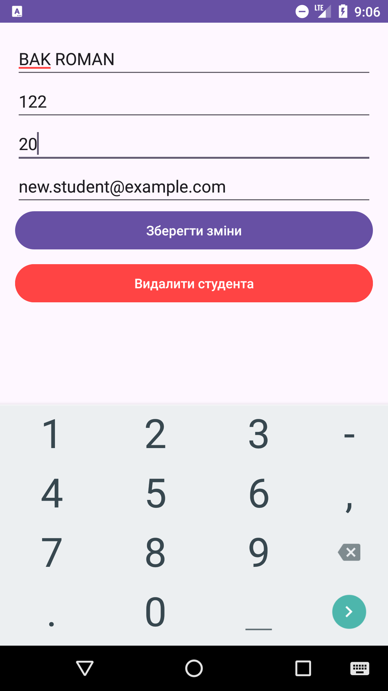

# Проєкт "Управління студентами"

Цей проєкт є мобільним застосунком для управління інформацією про студентів. Він дозволяє додавати, редагувати та видаляти студентів із використанням локальної бази даних у форматі JSON. Застосунок підтримує функціонал для збереження та завантаження студентів, а також для редагування та видалення даних студентів.

## Опис

Застосунок реалізує кілька ключових функцій:
1. **Завантаження студентів** - студенти зберігаються в локальному файлі `students.json`, який можна завантажити в застосунок при запуску.
2. **Додавання нового студента** - додавання нового студента у список та збереження змін у файл.
3. **Редагування даних студента** - можна редагувати ім'я, спеціальність, вік та електронну пошту студента.
4. **Видалення студента** - студент може бути видалений із списку.

## Структура проєкту

1. **MainActivity.kt** - основна активність, яка відображає список студентів.
2. **StudentDetailActivity.kt** - активність для перегляду та редагування даних конкретного студента.
3. **StudentViewModel.kt** - ViewModel, який керує даними студентів.
4. **StudentRepository.kt** - репозиторій, який відповідає за завантаження та збереження студентів у форматі JSON.
5. **activity_main.xml** - макет для головної активності.
6. **activity_student_detail.xml** - макет для активності редагування студента.

## Технології

- Kotlin
- Android SDK
- Gson для роботи з JSON
- ViewModel та LiveData для керування станом даних
- Корутин для асинхронних операцій

## Основні класи та їх функціональність

### 1. **StudentViewModel**

- Управляє даними студентів, що зберігаються в LiveData.
- Забезпечує завантаження, додавання, оновлення та видалення студентів.
- Використовує репозиторій для збереження даних у форматі JSON.

### 2. **StudentRepository**

- Використовується для взаємодії з даними студентів, включаючи збереження та завантаження їх з JSON файлів.

### 3. **StudentDetailActivity**

- Екран для редагування деталей студента.
- Дозволяє користувачам змінювати дані студента або видаляти його зі списку.
## Як додати нового студента

1. Відкрийте головну сторінку додатку.
2. Натисніть на кнопку "Додати студента".
3. Заповніть форму з ім'ям, спеціальністю, віком та електронною поштою студента.
4. Натисніть "Зберегти", щоб додати студента до списку.

## Як редагувати студента

1. Виберіть студента зі списку.
2. На екрані деталей студента натисніть кнопку "Редагувати".
3. Оновіть інформацію про студента.
4. Натисніть "Зберегти зміни" для оновлення даних.

## Як видалити студента

1. Виберіть студента зі списку.
2. На екрані деталей студента натисніть кнопку "Видалити".
3. Підтвердіть видалення.
## Робота додатку

